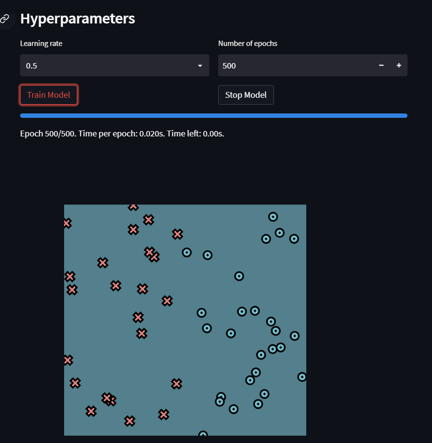
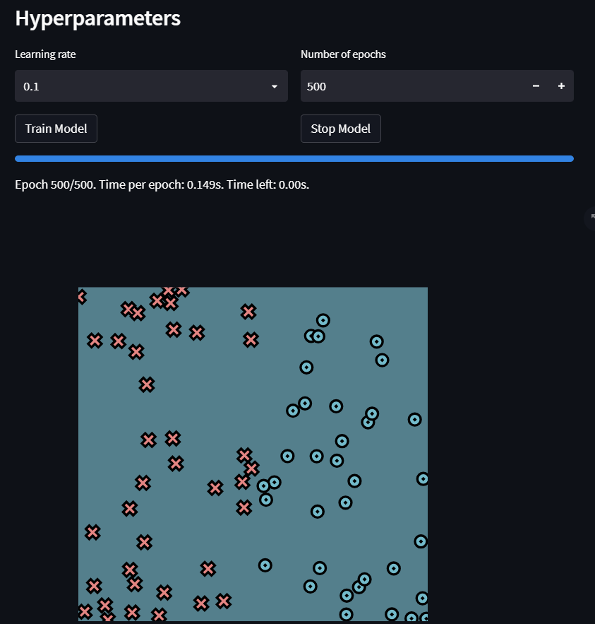
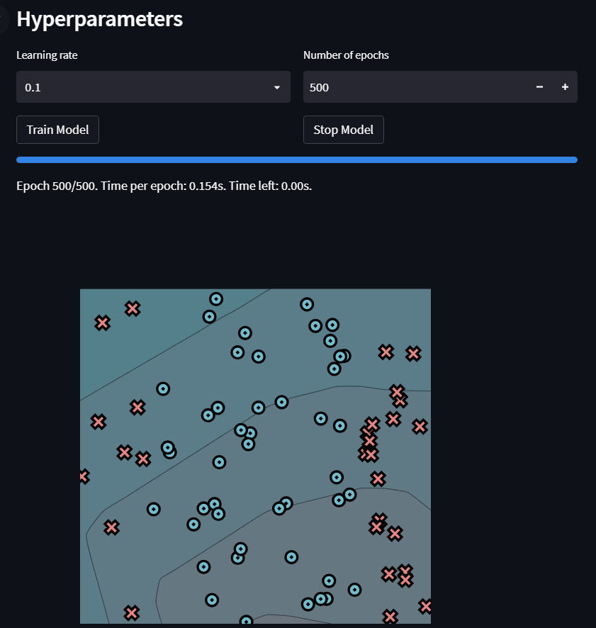
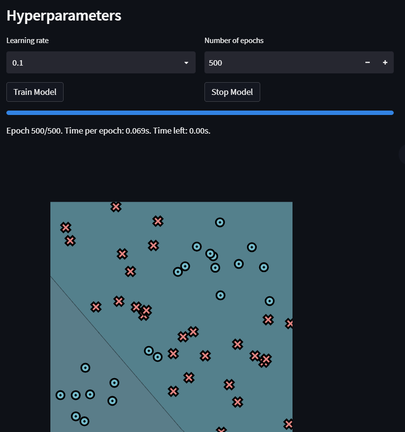

[](https://classroom.github.com/a/YFgwt0yY)
# MiniTorch Module 2


* Docs: https://minitorch.github.io/

* Overview: https://minitorch.github.io/module2/module2/

This assignment requires the following files from the previous assignments. You can get these by running

```bash
python sync_previous_module.py previous-module-dir current-module-dir
```

The files that will be synced are:

        minitorch/operators.py minitorch/module.py minitorch/autodiff.py minitorch/scalar.py minitorch/scalar_functions.py minitorch/module.py project/run_manual.py project/run_scalar.py project/datasets.py


## Simple Dataset

75 points, x hidden layers = 8 , learning rate = 0.1, Number of Epochs = 500



```
Epoch: 0/500, loss: 0, correct: 0
Epoch: 10/500, loss: 55.92342318680117, correct: 34
Epoch: 20/500, loss: 56.16399827512248, correct: 33
Epoch: 30/500, loss: 56.44287123535785, correct: 31
Epoch: 40/500, loss: 56.76196625294202, correct: 29
Epoch: 50/500, loss: 57.123560297716445, correct: 29
Epoch: 60/500, loss: 57.53033114376674, correct: 29
Epoch: 70/500, loss: 57.98541667010833, correct: 26
Epoch: 80/500, loss: 58.49248824572857, correct: 29
Epoch: 90/500, loss: 59.055841910004816, correct: 30
Epoch: 100/500, loss: 59.68051230543645, correct: 31
Epoch: 110/500, loss: 60.372416054310854, correct: 31
Epoch: 120/500, loss: 61.13853372201038, correct: 33
Epoch: 130/500, loss: 61.987143028140764, correct: 34
Epoch: 140/500, loss: 62.92812110421349, correct: 35
Epoch: 150/500, loss: 63.973341239050214, correct: 36
Epoch: 160/500, loss: 65.13720115593115, correct: 36
Epoch: 170/500, loss: 66.43733788230178, correct: 36
Epoch: 180/500, loss: 67.8956129574247, correct: 36
Epoch: 190/500, loss: 69.53949868520253, correct: 36
Epoch: 200/500, loss: 71.4040754735444, correct: 36
Epoch: 210/500, loss: 73.53498915505632, correct: 36
Epoch: 220/500, loss: 75.9929701813461, correct: 36
Epoch: 230/500, loss: 78.86099917402811, correct: 36
Epoch: 240/500, loss: 82.2561732149053, correct: 36
Epoch: 250/500, loss: 86.35039486523505, correct: 36
Epoch: 260/500, loss: 91.40870394776917, correct: 36
Epoch: 270/500, loss: 97.8653870246895, correct: 36
Epoch: 280/500, loss: 106.48513854284165, correct: 36
Epoch: 290/500, loss: 118.69340331974395, correct: 36
Epoch: 300/500, loss: 136.51268924261106, correct: 36
Epoch: 310/500, loss: 150.62293056010398, correct: 36
Epoch: 320/500, loss: 143.33786323259463, correct: 36
Epoch: 330/500, loss: 136.02826217265718, correct: 36
Epoch: 340/500, loss: 131.1424791059059, correct: 36
Epoch: 350/500, loss: 128.427116899888, correct: 36
Epoch: 360/500, loss: 130.45880395717978, correct: 36
Epoch: 370/500, loss: 139.74177584782083, correct: 36
Epoch: 380/500, loss: 152.56611090547824, correct: 36
Epoch: 390/500, loss: 167.19367915556128, correct: 36
Epoch: 400/500, loss: 179.16891434385434, correct: 36
Epoch: 410/500, loss: 190.28058617253316, correct: 36
Epoch: 420/500, loss: 240.08009186725184, correct: 36
Epoch: 430/500, loss: 538.8048757606248, correct: 36
Epoch: 440/500, loss: 538.8048757606248, correct: 36
Epoch: 450/500, loss: 538.8048757606248, correct: 36
Epoch: 460/500, loss: 538.8048757606248, correct: 36
Epoch: 470/500, loss: 538.8048757606248, correct: 36
Epoch: 480/500, loss: 538.8048757606248, correct: 36
Epoch: 490/500, loss: 538.8048757606248, correct: 36
Epoch: 500/500, loss: 538.8048757606248, correct: 36
```

## Diag Dataset

75 points, x hidden layers = 8 , learning rate = 0.1, Number of Epochs = 500



```
Epoch: 0/500, loss: 0, correct: 0
Epoch: 10/500, loss: 52.34651568416654, correct: 33
Epoch: 20/500, loss: 51.66442512934614, correct: 37
Epoch: 30/500, loss: 51.00821795238658, correct: 39
Epoch: 40/500, loss: 50.37650455774725, correct: 44
Epoch: 50/500, loss: 49.76799920173493, correct: 48
Epoch: 60/500, loss: 49.18151048939143, correct: 49
Epoch: 70/500, loss: 48.615932926063415, correct: 55
Epoch: 80/500, loss: 48.07023938820648, correct: 57
Epoch: 90/500, loss: 47.54347439781436, correct: 59
Epoch: 100/500, loss: 47.03474810146088, correct: 60
Epoch: 110/500, loss: 46.54323086888128, correct: 62
Epoch: 120/500, loss: 46.06814843777212, correct: 63
Epoch: 130/500, loss: 45.608777541429085, correct: 63
Epoch: 140/500, loss: 45.16444196428521, correct: 63
Epoch: 150/500, loss: 44.73450897759901, correct: 63
Epoch: 160/500, loss: 44.31838611368897, correct: 63
Epoch: 170/500, loss: 43.91551824237511, correct: 63
Epoch: 180/500, loss: 43.52538491781829, correct: 63
Epoch: 190/500, loss: 43.14749796785303, correct: 63
Epoch: 200/500, loss: 42.78139930128614, correct: 63
Epoch: 210/500, loss: 42.42665891156443, correct: 63
Epoch: 220/500, loss: 42.08287305776133, correct: 63
Epoch: 230/500, loss: 41.749662606055956, correct: 63
Epoch: 240/500, loss: 41.426671516822246, correct: 63
Epoch: 250/500, loss: 41.11356546415105, correct: 63
Epoch: 260/500, loss: 40.81003057613082, correct: 63
Epoch: 270/500, loss: 40.51577228553569, correct: 63
Epoch: 280/500, loss: 40.230514281745, correct: 63
Epoch: 290/500, loss: 39.95399755576133, correct: 63
Epoch: 300/500, loss: 39.685979531125355, correct: 63
Epoch: 310/500, loss: 39.42623327435944, correct: 63
Epoch: 320/500, loss: 39.17454677932493, correct: 63
Epoch: 330/500, loss: 38.9307223205573, correct: 63
Epoch: 340/500, loss: 38.694575871263396, correct: 63
Epoch: 350/500, loss: 38.46593658223386, correct: 63
Epoch: 360/500, loss: 38.24464631844894, correct: 63
Epoch: 370/500, loss: 38.030559250646604, correct: 63
Epoch: 380/500, loss: 37.82354149958261, correct: 63
Epoch: 390/500, loss: 37.623470831153504, correct: 63
Epoch: 400/500, loss: 37.43023640097602, correct: 63
Epoch: 410/500, loss: 37.243738547431334, correct: 63
Epoch: 420/500, loss: 37.06388863259333, correct: 63
Epoch: 430/500, loss: 36.89060893087152, correct: 63
Epoch: 440/500, loss: 36.723832565620285, correct: 63
Epoch: 450/500, loss: 36.563503494402084, correct: 63
Epoch: 460/500, loss: 36.40957654404861, correct: 63
Epoch: 470/500, loss: 36.26201749715101, correct: 63
Epoch: 480/500, loss: 36.120803232135266, correct: 63
Epoch: 490/500, loss: 35.98592191965141, correct: 63
Epoch: 500/500, loss: 35.85737327863681, correct: 63
```

## Split Dataset

75 points, x hidden layers = 8 , learning rate = 0.1, Number of Epochs = 500



```
Epoch: 0/500, loss: 0, correct: 0
Epoch: 10/500, loss: 65.87660729880452, correct: 29
Epoch: 20/500, loss: 64.79784816815386, correct: 29
Epoch: 30/500, loss: 63.79037810835966, correct: 29
Epoch: 40/500, loss: 62.84803369654718, correct: 29
Epoch: 50/500, loss: 61.96540259631833, correct: 29
Epoch: 60/500, loss: 61.13771129239719, correct: 29
Epoch: 70/500, loss: 60.360733037616775, correct: 29
Epoch: 80/500, loss: 59.63071181985047, correct: 29
Epoch: 90/500, loss: 58.944299137625336, correct: 29
Epoch: 100/500, loss: 58.298501100470006, correct: 29
Epoch: 110/500, loss: 57.69063391513619, correct: 29
Epoch: 120/500, loss: 57.1182862315175, correct: 29
Epoch: 130/500, loss: 56.57928713750687, correct: 29
Epoch: 140/500, loss: 56.07167883525928, correct: 29
Epoch: 150/500, loss: 55.59369322044938, correct: 29
Epoch: 160/500, loss: 55.143731734324255, correct: 29
Epoch: 170/500, loss: 54.720347975370416, correct: 29
Epoch: 180/500, loss: 54.32223265045703, correct: 30
Epoch: 190/500, loss: 53.94820051979784, correct: 33
Epoch: 200/500, loss: 53.597179050086375, correct: 33
Epoch: 210/500, loss: 53.2681985388209, correct: 34
Epoch: 220/500, loss: 52.96038351253766, correct: 38
Epoch: 230/500, loss: 52.672945234270635, correct: 38
Epoch: 240/500, loss: 52.40517518248854, correct: 40
Epoch: 250/500, loss: 52.156439386164024, correct: 40
Epoch: 260/500, loss: 51.92617351939036, correct: 37
Epoch: 270/500, loss: 51.71387867480091, correct: 38
Epoch: 280/500, loss: 51.519117748526476, correct: 39
Epoch: 290/500, loss: 51.341512381014276, correct: 41
Epoch: 300/500, loss: 51.18074040810858, correct: 43
Epoch: 310/500, loss: 51.03653378566774, correct: 43
Epoch: 320/500, loss: 50.90867695893289, correct: 43
Epoch: 330/500, loss: 50.797005655096115, correct: 42
Epoch: 340/500, loss: 50.701406084239565, correct: 41
Epoch: 350/500, loss: 50.6218145402131, correct: 43
Epoch: 360/500, loss: 50.558217399256485, correct: 45
Epoch: 370/500, loss: 50.51065152041495, correct: 46
Epoch: 380/500, loss: 50.4792050582125, correct: 46
Epoch: 390/500, loss: 50.46401870481143, correct: 46
Epoch: 400/500, loss: 50.46528738618668, correct: 46
Epoch: 410/500, loss: 50.48326244489834, correct: 46
Epoch: 420/500, loss: 50.51825435110566, correct: 46
Epoch: 430/500, loss: 50.570635993822236, correct: 46
Epoch: 440/500, loss: 50.640846616430586, correct: 46
Epoch: 450/500, loss: 50.7293964745855, correct: 46
Epoch: 460/500, loss: 50.83687231139328, correct: 46
Epoch: 470/500, loss: 50.96394376483468, correct: 46
Epoch: 480/500, loss: 51.11137084667493, correct: 46
Epoch: 490/500, loss: 51.28001266168091, correct: 46
Epoch: 500/500, loss: 51.47083757226598, correct: 46
```

# Xor Dataset

50 points, x hidden layers = 6 , learning rate = 0.1, Number of Epochs = 500



```
Epoch: 0/500, loss: 0, correct: 0
Epoch: 10/500, loss: 35.465406421625445, correct: 28
Epoch: 20/500, loss: 35.47280266941936, correct: 26
Epoch: 30/500, loss: 35.48727201970158, correct: 28
Epoch: 40/500, loss: 35.508788253775556, correct: 29
Epoch: 50/500, loss: 35.53733970561165, correct: 30
Epoch: 60/500, loss: 35.57292910914122, correct: 33
Epoch: 70/500, loss: 35.61557352178609, correct: 31
Epoch: 80/500, loss: 35.66530432293302, correct: 28
Epoch: 90/500, loss: 35.72216728684348, correct: 25
Epoch: 100/500, loss: 35.78622273025644, correct: 24
Epoch: 110/500, loss: 35.85754573570579, correct: 18
Epoch: 120/500, loss: 35.936226452353786, correct: 17
Epoch: 130/500, loss: 36.02237047694498, correct: 17
Epoch: 140/500, loss: 36.116099318330114, correct: 15
Epoch: 150/500, loss: 36.21755094990856, correct: 14
Epoch: 160/500, loss: 36.32688045530981, correct: 14
Epoch: 170/500, loss: 36.444260773695895, correct: 14
Epoch: 180/500, loss: 36.569883552238466, correct: 14
Epoch: 190/500, loss: 36.70396011463244, correct: 15
Epoch: 200/500, loss: 36.84672255597564, correct: 17
Epoch: 210/500, loss: 36.998424976008984, correct: 18
Epoch: 220/500, loss: 37.159344864605664, correct: 18
Epoch: 230/500, loss: 37.3297846555717, correct: 20
Epoch: 240/500, loss: 37.5100734673235, correct: 22
Epoch: 250/500, loss: 37.70056905190648, correct: 22
Epoch: 260/500, loss: 37.90165997719214, correct: 22
Epoch: 270/500, loss: 38.113768071029824, correct: 22
Epoch: 280/500, loss: 38.33735116075255, correct: 22
Epoch: 290/500, loss: 38.57290614688245, correct: 22
Epoch: 300/500, loss: 38.82097245632441, correct: 22
Epoch: 310/500, loss: 39.082135927990976, correct: 22
Epoch: 320/500, loss: 39.35703319293353, correct: 22
Epoch: 330/500, loss: 39.64635662199575, correct: 22
Epoch: 340/500, loss: 39.95085992717372, correct: 22
Epoch: 350/500, loss: 40.271364518787585, correct: 22
Epoch: 360/500, loss: 40.608766739910024, correct: 22
Epoch: 370/500, loss: 40.96404612311052, correct: 22
Epoch: 380/500, loss: 41.338274843552696, correct: 22
Epoch: 390/500, loss: 41.732628578242085, correct: 22
Epoch: 400/500, loss: 42.14839902560261, correct: 22
Epoch: 410/500, loss: 42.58700839497326, correct: 22
Epoch: 420/500, loss: 43.05002624525282, correct: 22
Epoch: 430/500, loss: 43.53918914001562, correct: 22
Epoch: 440/500, loss: 44.05642369868079, correct: 22
Epoch: 450/500, loss: 44.603873767452676, correct: 22
Epoch: 460/500, loss: 45.18393262032758, correct: 22
Epoch: 470/500, loss: 45.79928134407365, correct: 22
Epoch: 480/500, loss: 46.452934882132226, correct: 22
Epoch: 490/500, loss: 47.14829763969233, correct: 22
Epoch: 500/500, loss: 47.889231127027045, correct: 22
```

## End